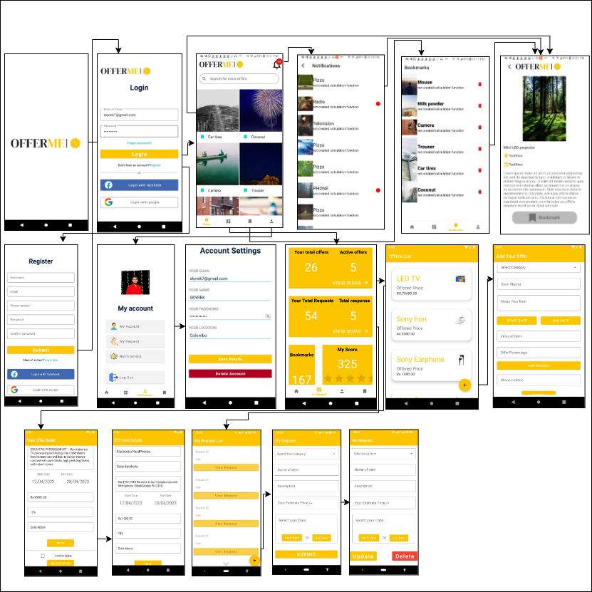

# OFFER-ME-Android-App
Android application to share and aware about upgoing offers among community. Uses google firebase platform for backend services. Is being implemented as a asignment for Mobile Application Development module.
<html>
   

      <h2>Application Overview</h2>
      
      

         
      

   

</html>
